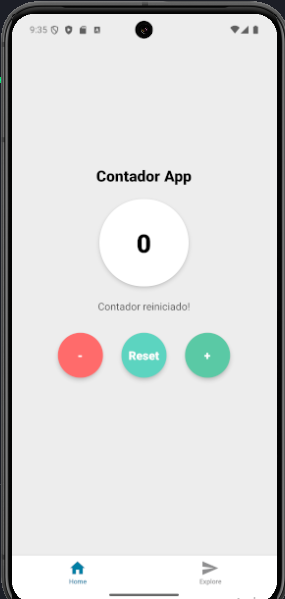

# Contador App 

Aplicativo de contador desenvolvido com React Native e Expo.

## Funcionalidades

- Incrementar o contador 
- Diminuir o contador 
- Resetar o valor para zero 
- Feedback visual ao resetar 

## Tecnologias utilizadas

- [React Native](https://reactnative.dev/)
- [Expo](https://expo.dev/)
- Estilização com StyleSheet
- Componentes customizados com TouchableOpacity

